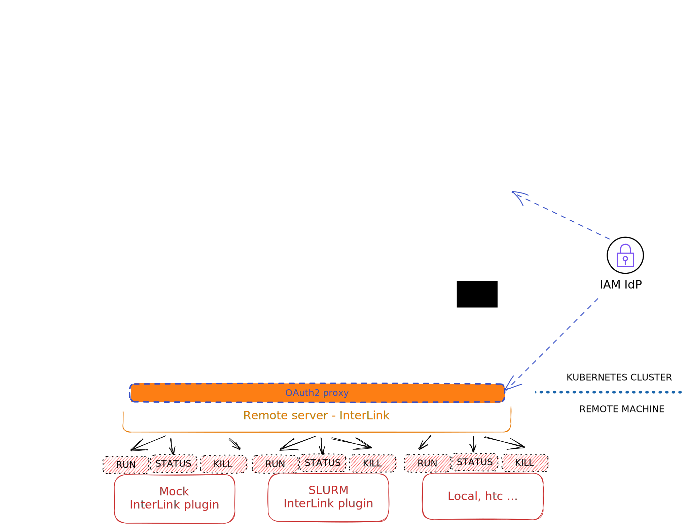

# InterLink
## :information_source: Overview

This project aims to enable a communication between a Kubernetes VitualKubelet and a container manager, like for example Docker.
The project is based on KNoC, for reference, check https://github.com/CARV-ICS-FORTH/knoc
Everything is thought to be modular and it's divided in different layers. These layers are summarized in the following drawing:



## :information_source: Components

- Virtual kubelet:
We have implemented 3 more functions able to communicate with the InterLink layer; these functions are called createRequest, deleteRequest and statusRequest, which calls through a REST API to the InterLink layer. Request uses a POST, deleteRequest uses a DELETE, statusRequest uses a GET.

- InterLink:
This is the layer managing the communication with the plug-ins. We began implementing a Mock module, to return dummy answers, and then moved towards a Docker plugin, using a library to emulate a shell to call the Docker CLI commands to implement containers creation, deletion and status querying. We chose to not use Docker API to extend modularity and porting to other managers, since we can think to use a job workload queue like Slurm.

- Sidecars: 
Basically, that's the name we refer to each plug-in talking with the InterLink layer. Each Sidecar is inependent and separately talks with the InterLink layer.

## :grey_exclamation: Requirements
- Golang >= 1.18.9 (might work with older version, but didn't test)
- A working Kubernetes instance
- An already set up KNoC environment
- Docker
- Sbatch, Scancel and Squeue (Slurm environment) for the Slurm sidecar

## Quick references:
- [Quick Start](#fast_forward-quick-start)
- [Building from sources](#hammer-building-from-sources)
- [Kustomize your Virtual Kubelet](#wrench-kustomizing-your-virtual-kubelet)
- [InterLink Config file](#information_source-interlink-config-file)
- [Environment Variables list](#information_source-environment-variables-list)
- [Usage](#question-usage)

## :fast_forward: Quick Start
- Fastest way to start using interlink, is by deploying a VK in Kubernetes using the prebuilt image:
    ```bash
    kubectl create ns vk
    kubectl kustomize ./kustomizations
    kubectl apply -n vk -k ./kustomizations
    ```

- Build InterLink and Sidecars binaries by simply using make:
    ```bash
    make all
    ```
    Output files will be created within the bin folder.

- Now you have your VK running and you have built needed binaries, specify in the configuration file named InterLinkConfig.yaml, located under ./config, which service (Slurm/Docker for the moment) you want to use. You only have to set the SidecarService to either "docker" or "slurm". Check the [InterLink Config File](#information_source-interlink-config-file) section for a detailed explanation of each value in the file.
- Run your InterLink and Sidecar executables. You are now running:
    - A Virtual Kubelet
    - The InterLink service
    - A Sidecar
- Submit a YAML to your K8S cluster to test it. You could try:
    ```bash
    kubectl apply -f examples/interlink_mock/payloads/busyecho_k8s.yaml -n vk
    ```
Note: I will soon update the quick start section to only use docker images / k8s deployments

## :hammer: Building from sources
It is possible you need to perform some adjustments or any modification to the source code and you want to rebuild it. You can build both binaries, Docker images and even customize your own Kubernetes deployment. 
### :hash: Binaries
Building standalone binaries is way easier and all you need is a simple
 ```bash
make all
```
You will find all VK, InterLink and Sidecars binaries in the bin folder. 
If you want to only build a component, replace 'all' with vk/interlink/sidecars to only build the respective component.

### :whale2: Docker images
Building Docker Images is still simple, but requires 'a little' more effort.
- First of all, login into your Docker Hub account
    ```bash
    docker login
    ```
- Then you can build and push your new images to your Docker Hub. Remember to specify the correct Dockerfile, according to your needs; here's an example with the Virtual Kubelet image:
    ```bash
    docker build -t *your docker hub username*/vk:latest -f Dockerfile.vk .
    docker push *your docker hub username*/vk:latest
    ```

### :electron: Kubernetes deployment
It's basically building a Docker image with additional steps. After [building your images](#whale2-docker-images), just deploy them. If you haven't already created the proper namespace, do it now and apply your kustomizations:
```bash
kubectl create ns vk
kubectl kustomize ./kustomizations
```
Then, simply apply. Remember to specify the correct namespace.
```bash
kubectl apply -n vk -k ./kustomizations
```
After pushing the image, edit the deployment.yaml file, located inside the kustomization sub-folder, to reflect the new image name. Check the [Kustomizing your Virtual Kubelet](#wrench-kustomizing-your-Virtual-Kubelet) section for more informations on how to customize your VK deployment.

### :question: Usage
TO BE DONE

### :wrench: Kustomizing your Virtual Kubelet
Since ideally the Virtual Kubelet runs into a Docker Container orchestred by a Kubernetes cluster, it is possible to customize your deployment by editing configuration files within the kustomizations directory:
- kustomization.yaml: here you can specify resource files and generate configMaps
- deployment.yaml: that's the main file you want to edit. Nested into spec -> template -> spec -> containers you can find these fields:
    - name: the container name
    - image: Here you can specify which image to use, if you need another one. 
    - args: These are the arguments passed to the VK binary running inside the container.
    - env: Environment Variables used by kubelet and by the VK itself. Check the ENVS list for a detailed explanation on how to set them.
- knoc-cfg.json: it's the config file for the VK itself. Here you can specify how many resources to allocate for the VK. Note that the name specified here for the VK must match the name given in the others config files.
- InterLinkConfig.yaml: configuration file for the inbound/outbound communication (and not only) to/from the InterLink module. For a detailed explanation of all fields, check the [InterLink Config File](#information_source-interlink-config-file) section.
If you perform any change to the listed files, you will have to
```bash
kubectl apply -n vk -k ./kustomizations
```
You can also use Environment Variables to overwrite the majority of default values and even the ones configured in the InterLink Config file. Check the [Environment Variables list](#information_source-environment-variables-list) for a detailed explanation.

### :information_source: InterLink Config file
Detailed explanation of the InterLink config file key values.
- InterlinkURL -> the URL to allow the Virtual Kubelet to contact the InterLink module. 
- SidecarURL -> the URL to allow InterLink to communicate with the Sidecar module (docker, slurm, etc). Do not specify port here
- InterlinkPort -> the Interlink listening port. InterLink and VK will communicate over this port.
- SidecarService -> the sidecar service. At the moment, it can be only "slurm" or "docker". According to the specified service, InterLink will automatically set the listening port to 4000 for Docker and 4001 for Slurm. set $SIDECARPORT environment variable to specify a custom one
- CommandPrefix -> here you can specify a prefix for the programmatically generated script (for the slurm plugin). Basically, if you want to run anything before the script itself, put it here.
- Tsocks -> true or false values only. Enables or Disables the use of tsocks library to allow proxy networking. Only implemented for the Slurm sidecar at the moment.
- TsocksPath -> path to your tsocks library.
- TsocksLoginNode -> specify an existing node to ssh to. It will be your "window to the external world"

### :information_source: Environment Variables list
Here's the complete list of every customizable environment variable. When specified, it overwrites the listed key within the InterLink config file.
- $INTERLINKURL -> the URL to allow the Virtual Kubelet to contact the InterLink module. Do not specify a port here. Overwrites InterlinkURL.
- $INTERLINKPORT -> the InterLink listening port. InterLink and VK will communicate over this port. Overwrites InterlinkPort.
- $INTERLINKCONFIGPATH -> your config file path
- $SIDECARURL -> the URL to allow InterLink to communicate with the Sidecar module (docker, slurm, etc). Do not specify port here. Overwrites SidecarURL.
- $SIDECARPORT -> the Sidecar listening port. Docker default is 4000, Slurm default is 4001.
- $SIDECARSERVICE -> can be "docker" or "slurm" only (for the moment). If SIDECARPORT is not set, will set Sidecar Port in the code to default settings. Overwrites SidecarService.
- $TSOCKS -> true or false, to use tsocks library allowing proxy networking. Working on Slurm sidecar at the moment. Overwrites Tsocks.
- $TSOCKSPATH -> path to your tsocks library. Overwrites TsocksPath.
